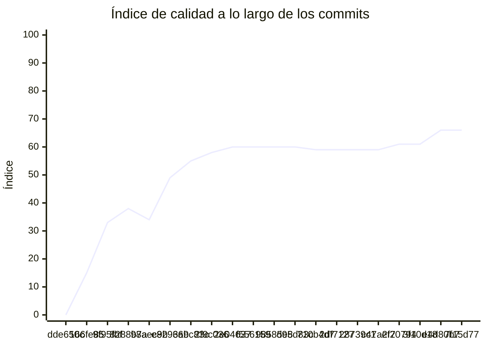

<!-- evaluacion:inicio -->
# Evaluación — prog2-portal-rocio/svc-catalogo

> Documento **generado automáticamente** por la cátedra de Programación II (UM): RepoSense + análisis de calidad de **7 dimensiones**. **No editar a mano**: se regenera en cada evaluación.
> Rama evaluada: `main`. Análisis **heurístico** (regex + métricas) + build: es una criba para orientar la revisión, **no una nota**. La **documentación** del repositorio no se evalúa.
> Generado: 2026-11-18.

## 1. Veredicto

| Aspecto | Resultado |
|---|---|
| Índice de calidad | **77/100** |
| Tipo de repositorio | `backend` |
| Build (`mvnw verify` / `gradlew check`) | OK |
| Código (LOC) | 7,582 |
| Archivos de código | 120 |
| Clases | 126 |
| Código dentro de clases (%POO) | 80% |
| Funciones fuera de clases | 0 |
| Duplicación (puerta) | 8.5% |
| Duplicación lógica | 8.9% |
| Duplicación de boilerplate | 7.4% |
| Cobertura | 98% |
| Tope duro aplicado a D1 | `POO_BAJO` → D1 ≤ 60 |

> Este informe **describe** lo que el análisis midió con los criterios ya establecidos de la materia. No es una nota.

## 2. Semáforo de aprobación

Criterios de la cátedra (`CRITERIOS-CALIDAD.md`): **Aprobar** se juega con el perfil `estandar`; **destacar**, con el `exigente` (meta de excelencia).

| Semáforo | Resultado |
|---|---|
| Aprobar (`estandar`) | **no cumple** — 7/11 |
| Destacar (`exigente`) | **no cumple** — 5/11 |

**Para aprobar, falta cumplir:** Duplicación

**Para destacar, falta cumplir:** SOLID; POO; Duplicación

## 3. Autoría (RepoSense)

| Autor | Commits | Código (LOC) | Tests (LOC) | Docs (LOC) | Días activos | % del código |
|---|---:|---:|---:|---:|---:|---:|
| Pilar Rocío Portal Romano | 1 | 0 | 0 | 0 | 14 | 0% |

> _El LOC de autoría lo calcula RepoSense sobre el historial y puede diferir del LOC de código del análisis (que mira el estado de `main`)._

## 4. Dimensiones evaluadas

Cada dimensión indica **qué mide**, **por qué importa** y **tu resultado**. Cuando el puntaje queda por debajo de la referencia, se agregan preguntas para **investigar la causa** (no hay recetas).

| Dimensión | Peso | Puntaje |
|:--|--:|--:|
| **D1** Diseño OO, SOLID y patrones (20%) | 20% | 5 |
| **D2** Arquitectura hexagonal — backend (15%) | 15% | 100 |
| **D3** Frontend KMP: MVVM y buenas prácticas (10%) | 10% | N/A |
| **D4** Integración y contrato (10%) | 10% | 80 |
| **D5** Seguridad y robustez (10%) | 10% | 100 |
| **D6** Pruebas y cobertura (20%) | 20% | 100 |
| **D7** Proceso y entrega (15%) | 15% | 100 |

### D1. Diseño OO, SOLID y patrones (20%)

- **Qué mide:** Métricas orientadas a objetos (clases, métodos, campos, cohesión, acoplamiento, herencia) y proxies de SOLID, más patrones de diseño.
- **Por qué importa:** El eje de la materia es el buen uso de la POO y su arquitectura: un diseño con clases claras y poco acopladas es más fácil de entender, probar y cambiar.
- **Tu resultado:** **5/100**
- **Para investigar la causa:**
    - ¿Se pensó el modelo de clases antes de codificar o se agrupó después?
    - ¿Qué clases concentran muchas responsabilidades a la vez?
    - ¿Los colaboradores llegan como parámetros o se crean por dentro?

### D2. Arquitectura hexagonal — backend (15%)

- **Qué mide:** Separación en capas (dominio, puertos de entrada/salida, adaptadores) y dirección de las dependencias del backend.
- **Por qué importa:** Aislar el dominio de la infraestructura permite cambiar la base de datos, el framework o el transporte sin tocar las reglas de negocio.
- **Tu resultado:** **100/100**

### D4. Integración y contrato (10%)

- **Qué mide:** Cumplimiento del contrato de integración de la cátedra (formato de errores, paginación, autenticación, endpoints esperados).
- **Por qué importa:** Los servicios deben poder integrarse entre sí y con la app sin sorpresas; el contrato es lo que hacen cumplir las pruebas de integración.
- **Tu resultado:** **80/100**

### D5. Seguridad y robustez (10%)

- **Qué mide:** Credenciales embebidas, consultas SQL por concatenación, y presencia de config de entorno; aislamiento de secretos.
- **Por qué importa:** Un secreto en el repositorio o una consulta construida por concatenación son riesgos concretos, no hipotéticos.
- **Tu resultado:** **100/100**

### D6. Pruebas y cobertura (20%)

- **Qué mide:** Cantidad y resultado de pruebas y cobertura de línea (JaCoCo/Kover, Surefire/Failsafe) cuando hay build.
- **Por qué importa:** Las pruebas son la red de seguridad para refactorizar e integrar; la cobertura acota las zonas sin verificar.
- **Tu resultado:** **100/100**

### D7. Proceso y entrega (15%)

- **Qué mide:** Artefactos verificables de proceso/entrega: `compose`, `.env.example`, CI (`.github/workflows/`), `CODEOWNERS` y wrapper de build (`mvnw`/`gradlew`). **No** puntúa documentación.
- **Por qué importa:** Un proyecto que compila, se levanta y se valida solo es más fácil de revisar y de integrar en equipo.
- **Tu resultado:** **100/100**

## 5. Señales detectadas

El análisis encontró las siguientes señales, con el archivo y la línea donde se originan cuando están disponibles:

**Archivos con más señales**

| Archivo | Señales |
|---|---:|
| `src/main/java/com/example/svccatalogo/catalogo/infrastructure/client/dto/SnapshotResponseDto.java` | 8 |
| `src/main/java/com/example/svccatalogo/catalogo/infrastructure/redis/CatalogoRedisAdapter.java` | 7 |
| `src/main/java/com/example/svccatalogo/catalogo/domain/model/HorarioSemanal.java` | 6 |
| `src/main/java/com/example/svccatalogo/catalogo/infrastructure/kafka/CatalogoKafkaConsumerAdapter.java` | 5 |
| `src/main/java/com/example/svccatalogo/catalogo/infrastructure/persistence/adapter/CatalogoIncrementalPersistenceAdapter.java` | 4 |
| `src/main/java/com/example/svccatalogo/catalogo/application/usecases/SincronizarCatalogoIncrementalUseCase.java` | 4 |
| `src/test/java/com/example/svccatalogo/catalogo/infrastructure/kafka/CatalogoKafkaConsumerAdapterTest.java` | 4 |
| `src/main/java/com/example/svccatalogo/catalogo/infrastructure/persistence/adapter/CatalogoSnapshotPersistenceAdapter.java` | 3 |
| `src/main/java/com/example/svccatalogo/catalogo/infrastructure/web/controller/ProfesionalController.java` | 3 |
| `src/main/java/com/example/svccatalogo/catalogo/infrastructure/web/dto/ProfesionalDetalleResponse.java` | 3 |

**SRP/responsabilidad** (39)
- método 'SincronizarCatalogoIncrementalUseCase.sincronizarCatalogoIncremental' de 70 líneas — `src/main/java/com/example/svccatalogo/catalogo/application/usecases/SincronizarCatalogoIncrementalUseCase.java:41`
- método 'SincronizarCatalogoIncrementalUseCase.sincronizarCatalogoIncremental' con complejidad 9 — `src/main/java/com/example/svccatalogo/catalogo/application/usecases/SincronizarCatalogoIncrementalUseCase.java:41`
- método 'SincronizarCatalogoIncrementalUseCase.reunirIdsModificados' con 5 parámetros — `src/main/java/com/example/svccatalogo/catalogo/application/usecases/SincronizarCatalogoIncrementalUseCase.java:132`
- clase 'Categoria' con baja cohesión (29%) — `src/main/java/com/example/svccatalogo/catalogo/domain/model/Categoria.java:5`
- método 'Categoria.Categoria' con 6 parámetros — `src/main/java/com/example/svccatalogo/catalogo/domain/model/Categoria.java:14`
- método 'CriteriosBusquedaProfesional.CriteriosBusquedaProfesional' con 5 parámetros — `src/main/java/com/example/svccatalogo/catalogo/domain/model/CriteriosBusquedaProfesional.java:6`
- método 'EstadoSincronizacion.EstadoSincronizacion' con 5 parámetros — `src/main/java/com/example/svccatalogo/catalogo/domain/model/EstadoSincronizacion.java:16`
- clase 'HorarioSemanal' grande (LOC=66, métodos=11, campos=9) — `src/main/java/com/example/svccatalogo/catalogo/domain/model/HorarioSemanal.java:11`
- clase 'HorarioSemanal' con baja cohesión (27%) — `src/main/java/com/example/svccatalogo/catalogo/domain/model/HorarioSemanal.java:11`
- método 'HorarioSemanal.HorarioSemanal' con 9 parámetros — `src/main/java/com/example/svccatalogo/catalogo/domain/model/HorarioSemanal.java:23`
- método 'HorarioSemanal.HorarioSemanal' con complejidad 6 — `src/main/java/com/example/svccatalogo/catalogo/domain/model/HorarioSemanal.java:23`
- clase 'Profesional' con baja cohesión (25%) — `src/main/java/com/example/svccatalogo/catalogo/domain/model/Profesional.java:5`
- método 'Profesional.Profesional' con 7 parámetros — `src/main/java/com/example/svccatalogo/catalogo/domain/model/Profesional.java:15`
- método 'SnapshotResponseDto.SnapshotResponseDto' de 39 líneas — `src/main/java/com/example/svccatalogo/catalogo/infrastructure/client/dto/SnapshotResponseDto.java:8`
- método 'SnapshotResponseDto.SnapshotResponseDto' con 5 parámetros — `src/main/java/com/example/svccatalogo/catalogo/infrastructure/client/dto/SnapshotResponseDto.java:8`
- método 'SnapshotResponseDto.CategoriaResponseDto' con 6 parámetros — `src/main/java/com/example/svccatalogo/catalogo/infrastructure/client/dto/SnapshotResponseDto.java:16`
- método 'CategoriaResponseDto.CategoriaResponseDto' con 6 parámetros — `src/main/java/com/example/svccatalogo/catalogo/infrastructure/client/dto/SnapshotResponseDto.java:16`
- método 'SnapshotResponseDto.ProfesionalResponseDto' con 7 parámetros — `src/main/java/com/example/svccatalogo/catalogo/infrastructure/client/dto/SnapshotResponseDto.java:26`
- método 'ProfesionalResponseDto.ProfesionalResponseDto' con 7 parámetros — `src/main/java/com/example/svccatalogo/catalogo/infrastructure/client/dto/SnapshotResponseDto.java:26`
- método 'SnapshotResponseDto.HorarioSemanalResponseDto' con 9 parámetros — `src/main/java/com/example/svccatalogo/catalogo/infrastructure/client/dto/SnapshotResponseDto.java:37`
- método 'HorarioSemanalResponseDto.HorarioSemanalResponseDto' con 9 parámetros — `src/main/java/com/example/svccatalogo/catalogo/infrastructure/client/dto/SnapshotResponseDto.java:37`
- clase 'CatalogoKafkaConsumerAdapter' grande (LOC=97, métodos=11, campos=2) — `src/main/java/com/example/svccatalogo/catalogo/infrastructure/kafka/CatalogoKafkaConsumerAdapter.java:18`
- método 'CatalogoKafkaConsumerAdapter.convertirNotificacion' de 62 líneas — `src/main/java/com/example/svccatalogo/catalogo/infrastructure/kafka/CatalogoKafkaConsumerAdapter.java:53`
- método 'CatalogoKafkaConsumerAdapter.convertirNotificacion' con complejidad 9 — `src/main/java/com/example/svccatalogo/catalogo/infrastructure/kafka/CatalogoKafkaConsumerAdapter.java:53`
- método 'CatalogoIncrementalPersistenceAdapter.aplicarVersion' de 60 líneas — `src/main/java/com/example/svccatalogo/catalogo/infrastructure/persistence/adapter/CatalogoIncrementalPersistenceAdapter.java:47`
- método 'CatalogoIncrementalPersistenceAdapter.aplicarVersion' con 5 parámetros — `src/main/java/com/example/svccatalogo/catalogo/infrastructure/persistence/adapter/CatalogoIncrementalPersistenceAdapter.java:47`
- método 'CatalogoSnapshotPersistenceAdapter.reemplazarCatalogo' de 55 líneas — `src/main/java/com/example/svccatalogo/catalogo/infrastructure/persistence/adapter/CatalogoSnapshotPersistenceAdapter.java:47`
- clase 'CatalogoRedisAdapter' grande (LOC=218, métodos=18, campos=9) — `src/main/java/com/example/svccatalogo/catalogo/infrastructure/redis/CatalogoRedisAdapter.java:26`
- clase 'CatalogoRedisAdapter' con baja cohesión (6%) — `src/main/java/com/example/svccatalogo/catalogo/infrastructure/redis/CatalogoRedisAdapter.java:26`
- método 'CatalogoRedisAdapter.obtenerCambios' de 47 líneas — `src/main/java/com/example/svccatalogo/catalogo/infrastructure/redis/CatalogoRedisAdapter.java:72`
- método 'CatalogoRedisAdapter.obtenerCambios' con complejidad 7 — `src/main/java/com/example/svccatalogo/catalogo/infrastructure/redis/CatalogoRedisAdapter.java:72`
- método 'CatalogoRedisAdapter.leerEntidad' de 32 líneas — `src/main/java/com/example/svccatalogo/catalogo/infrastructure/redis/CatalogoRedisAdapter.java:244`
- clase 'ProfesionalController' con baja cohesión (14%) — `src/main/java/com/example/svccatalogo/catalogo/infrastructure/web/controller/ProfesionalController.java:32`
- método 'EstadoSincronizacionResponse.EstadoSincronizacionResponse' con 5 parámetros — `src/main/java/com/example/svccatalogo/catalogo/infrastructure/web/dto/EstadoSincronizacionResponse.java:5`
- método 'HorarioSemanalResponse.HorarioSemanalResponse' con 9 parámetros — `src/main/java/com/example/svccatalogo/catalogo/infrastructure/web/dto/HorarioSemanalResponse.java:7`
- método 'ProfesionalDetalleResponse.ProfesionalDetalleResponse' con 8 parámetros — `src/main/java/com/example/svccatalogo/catalogo/infrastructure/web/dto/ProfesionalDetalleResponse.java:5`
- método 'ProfesionalDetalleResponse.CategoriaResponse' con 6 parámetros — `src/main/java/com/example/svccatalogo/catalogo/infrastructure/web/dto/ProfesionalDetalleResponse.java:16`
- método 'CategoriaResponse.CategoriaResponse' con 6 parámetros — `src/main/java/com/example/svccatalogo/catalogo/infrastructure/web/dto/ProfesionalDetalleResponse.java:16`
- método 'ProfesionalResponse.ProfesionalResponse' con 7 parámetros — `src/main/java/com/example/svccatalogo/catalogo/infrastructure/web/dto/ProfesionalResponse.java:5`

**DIP/concretos** (29)
- clase 'AplicarSnapshotCatalogoUseCase' muy acoplada (CBO=9) — `src/main/java/com/example/svccatalogo/catalogo/application/usecases/AplicarSnapshotCatalogoUseCase.java:14`
- clase 'ConsultarHorariosProfesionalUseCase' muy acoplada (CBO=8) — `src/main/java/com/example/svccatalogo/catalogo/application/usecases/ConsultarHorariosProfesionalUseCase.java:15`
- clase 'ConsultarProfesionalUseCase' muy acoplada (CBO=10) — `src/main/java/com/example/svccatalogo/catalogo/application/usecases/ConsultarProfesionalUseCase.java:14`
- clase 'ConsultarProfesionalUseCase' instancia 4 concretos (CBO=10) — `src/main/java/com/example/svccatalogo/catalogo/application/usecases/ConsultarProfesionalUseCase.java:14`
- clase 'ProcesarNotificacionCatalogoService' muy acoplada (CBO=12) — `src/main/java/com/example/svccatalogo/catalogo/application/usecases/ProcesarNotificacionCatalogoService.java:15`
- clase 'SincronizarCatalogoIncrementalUseCase' muy acoplada (CBO=19) — `src/main/java/com/example/svccatalogo/catalogo/application/usecases/SincronizarCatalogoIncrementalUseCase.java:18`
- clase 'HorarioSemanal' muy acoplada (CBO=9) — `src/main/java/com/example/svccatalogo/catalogo/domain/model/HorarioSemanal.java:11`
- clase 'HorarioSemanal' instancia 5 concretos (CBO=9) — `src/main/java/com/example/svccatalogo/catalogo/domain/model/HorarioSemanal.java:11`
- clase 'CatalogoRestClientAdapter' muy acoplada (CBO=13) — `src/main/java/com/example/svccatalogo/catalogo/infrastructure/client/CatalogoRestClientAdapter.java:14`
- clase 'CatalogoRestClientAdapter' instancia 5 concretos (CBO=13) — `src/main/java/com/example/svccatalogo/catalogo/infrastructure/client/CatalogoRestClientAdapter.java:14`
- clase 'CatalogoSnapshotMapper' muy acoplada (CBO=12) — `src/main/java/com/example/svccatalogo/catalogo/infrastructure/client/CatalogoSnapshotMapper.java:14`
- clase 'CatalogoSnapshotMapper' instancia 4 concretos (CBO=12) — `src/main/java/com/example/svccatalogo/catalogo/infrastructure/client/CatalogoSnapshotMapper.java:14`
- clase 'CatalogoKafkaConsumerAdapter' muy acoplada (CBO=19) — `src/main/java/com/example/svccatalogo/catalogo/infrastructure/kafka/CatalogoKafkaConsumerAdapter.java:18`
- clase 'CatalogoKafkaConsumerAdapter' instancia 11 concretos (CBO=19) — `src/main/java/com/example/svccatalogo/catalogo/infrastructure/kafka/CatalogoKafkaConsumerAdapter.java:18`
- clase 'CatalogoIncrementalPersistenceAdapter' muy acoplada (CBO=20) — `src/main/java/com/example/svccatalogo/catalogo/infrastructure/persistence/adapter/CatalogoIncrementalPersistenceAdapter.java:23`
- clase 'CatalogoIncrementalPersistenceAdapter' instancia 5 concretos (CBO=20) — `src/main/java/com/example/svccatalogo/catalogo/infrastructure/persistence/adapter/CatalogoIncrementalPersistenceAdapter.java:23`
- clase 'CatalogoSnapshotPersistenceAdapter' muy acoplada (CBO=23) — `src/main/java/com/example/svccatalogo/catalogo/infrastructure/persistence/adapter/CatalogoSnapshotPersistenceAdapter.java:23`
- clase 'CatalogoSnapshotPersistenceAdapter' instancia 3 concretos (CBO=23) — `src/main/java/com/example/svccatalogo/catalogo/infrastructure/persistence/adapter/CatalogoSnapshotPersistenceAdapter.java:23`
- clase 'EstadoSincronizacionPersistenceAdapter' muy acoplada (CBO=8) — `src/main/java/com/example/svccatalogo/catalogo/infrastructure/persistence/adapter/EstadoSincronizacionPersistenceAdapter.java:12`
- clase 'EventoCatalogoProcesadoJpaRepository' muy acoplada (CBO=9) — `src/main/java/com/example/svccatalogo/catalogo/infrastructure/persistence/repository/EventoCatalogoProcesadoJpaRepository.java:9`
- clase 'ProfesionalJpaRepository' muy acoplada (CBO=17) — `src/main/java/com/example/svccatalogo/catalogo/infrastructure/persistence/repository/ProfesionalJpaRepository.java:11`
- clase 'CatalogoRedisAdapter' muy acoplada (CBO=26) — `src/main/java/com/example/svccatalogo/catalogo/infrastructure/redis/CatalogoRedisAdapter.java:26`
- clase 'CatalogoRedisAdapter' instancia 17 concretos (CBO=26) — `src/main/java/com/example/svccatalogo/catalogo/infrastructure/redis/CatalogoRedisAdapter.java:26`
- clase 'JwtConfig' muy acoplada (CBO=22) — `src/main/java/com/example/svccatalogo/catalogo/infrastructure/security/JwtConfig.java:25`
- clase 'JwtConfig' instancia 4 concretos (CBO=22) — `src/main/java/com/example/svccatalogo/catalogo/infrastructure/security/JwtConfig.java:25`
- clase 'SecurityConfig' muy acoplada (CBO=12) — `src/main/java/com/example/svccatalogo/catalogo/infrastructure/security/SecurityConfig.java:14`
- clase 'ReconciliacionCatalogoInicioAdapter' muy acoplada (CBO=10) — `src/main/java/com/example/svccatalogo/catalogo/infrastructure/startup/ReconciliacionCatalogoInicioAdapter.java:12`
- clase 'ProfesionalController' muy acoplada (CBO=24) — `src/main/java/com/example/svccatalogo/catalogo/infrastructure/web/controller/ProfesionalController.java:32`
- clase 'ProfesionalController' instancia 6 concretos (CBO=24) — `src/main/java/com/example/svccatalogo/catalogo/infrastructure/web/controller/ProfesionalController.java:32`

**duplicación** (6)
- duplicación lógica: 8.5% · boilerplate: 7.4%
- bloque de 8 líneas repetido 7 veces en src/test/java/com/example/svccatalogo/catalogo/domain/model/HorarioSemanalTest.java:19, src/test/java/com/example/svccatalogo/catalogo/domain/model/HorarioSemanalTest.java:20, src/test/java/com/example/svccatalogo/catalogo/domain/model/HorarioSemanalTest.java:21 — `src/test/java/com/example/svccatalogo/catalogo/domain/model/HorarioSemanalTest.java:19`
- bloque de 8 líneas repetido 5 veces en src/test/java/com/example/svccatalogo/catalogo/infrastructure/kafka/CatalogoKafkaConsumerAdapterTest.java:148, src/test/java/com/example/svccatalogo/catalogo/infrastructure/kafka/CatalogoKafkaConsumerAdapterTest.java:155, src/test/java/com/example/svccatalogo/catalogo/infrastructure/kafka/CatalogoKafkaConsumerAdapterTest.java:162 — `src/test/java/com/example/svccatalogo/catalogo/infrastructure/kafka/CatalogoKafkaConsumerAdapterTest.java:148`
- bloque de 8 líneas repetido 5 veces en src/test/java/com/example/svccatalogo/catalogo/infrastructure/kafka/CatalogoKafkaConsumerAdapterTest.java:149, src/test/java/com/example/svccatalogo/catalogo/infrastructure/kafka/CatalogoKafkaConsumerAdapterTest.java:156, src/test/java/com/example/svccatalogo/catalogo/infrastructure/kafka/CatalogoKafkaConsumerAdapterTest.java:163 — `src/test/java/com/example/svccatalogo/catalogo/infrastructure/kafka/CatalogoKafkaConsumerAdapterTest.java:149`
- bloque de 8 líneas repetido 5 veces en src/test/java/com/example/svccatalogo/catalogo/infrastructure/kafka/CatalogoKafkaConsumerAdapterTest.java:150, src/test/java/com/example/svccatalogo/catalogo/infrastructure/kafka/CatalogoKafkaConsumerAdapterTest.java:157, src/test/java/com/example/svccatalogo/catalogo/infrastructure/kafka/CatalogoKafkaConsumerAdapterTest.java:164 — `src/test/java/com/example/svccatalogo/catalogo/infrastructure/kafka/CatalogoKafkaConsumerAdapterTest.java:150`
- bloque de 8 líneas repetido 5 veces en src/test/java/com/example/svccatalogo/catalogo/infrastructure/kafka/CatalogoKafkaConsumerAdapterTest.java:152, src/test/java/com/example/svccatalogo/catalogo/infrastructure/kafka/CatalogoKafkaConsumerAdapterTest.java:159, src/test/java/com/example/svccatalogo/catalogo/infrastructure/kafka/CatalogoKafkaConsumerAdapterTest.java:166 — `src/test/java/com/example/svccatalogo/catalogo/infrastructure/kafka/CatalogoKafkaConsumerAdapterTest.java:152`

## 6. Evolución por commit

Métricas calculadas sobre el estado de `main` en **cada commit** (20 commits con trabajo), del primero al último. La calidad usa el perfil `exigente`; el aporte de código lo mide RepoSense. El índice puede **bajar** al crecer el proyecto: se acumulan señales.

```mermaid
xychart-beta
    title "Índice de calidad a lo largo de los commits"
    x-axis ["dde650c", "166fe85", "9f95fbf", "8288b7a", "98aec9b", "e8296a9", "36bc83c", "2f9c036", "2e04637", "f556159", "98585e8", "d95d83c", "710b4d7", "2df7127", "28739c1", "c47a2f7", "ef20794", "3f10d18", "e4d80b7", "7f15d77"]
    y-axis "Índice" 0 --> 100
    line [0, 15, 33, 38, 34, 49, 55, 58, 60, 60, 60, 60, 59, 59, 59, 59, 61, 61, 66, 66]
```

| # | Fecha | Commit | Autor | LOC | Índice | %POO | Duplic. | Sueltas |
|---|---|---|---|---:|---:|---:|---:|---:|
| 1 | 2026-09-07 | `dde650c` | Pilar Rocío Portal Romano | 0 | 0 | 0% | 0.0% | 0 |
| 2 | 2026-09-10 | `166fe85` | Ing. Daniel Quinteros | 0 | 15 | 0% | 0.0% | 0 |
| 3 | 2026-10-12 | `9f95fbf` | Pilar Rocío Portal Romano | 18 | 33 | 56% | 0.0% | 0 |
| 4 | 2026-10-16 | `8288b7a` | Pilar Rocío Portal Romano | 18 | 38 | 56% | 0.0% | 0 |
| 5 | 2026-10-17 | `98aec9b` | Ing. Daniel Quinteros | 313 | 34 | 92% | 0.0% | 0 |
| 6 | 2026-10-20 | `e8296a9` | Pilar Rocío Portal Romano | 1,658 | 49 | 75% | 4.5% | 0 |
| 7 | 2026-10-23 | `36bc83c` | Pilar Rocío Portal Romano | 1,842 | 55 | 75% | 8.5% | 0 |
| 8 | 2026-10-25 | `2f9c036` | Pilar Rocío Portal Romano | 2,414 | 58 | 80% | 12.6% | 0 |
| 9 | 2026-10-26 | `2e04637` | Pilar Rocío Portal Romano | 2,684 | 60 | 80% | 12.6% | 0 |
| 10 | 2026-10-28 | `f556159` | Pilar Rocío Portal Romano | 2,858 | 60 | 79% | 11.9% | 0 |
| 11 | 2026-10-30 | `98585e8` | Pilar Rocío Portal Romano | 3,257 | 60 | 80% | 10.3% | 0 |
| 12 | 2026-11-01 | `d95d83c` | Pilar Rocío Portal Romano | 4,314 | 60 | 80% | 9.8% | 0 |
| 13 | 2026-11-07 | `710b4d7` | Pilar Rocío Portal Romano | 5,255 | 59 | 81% | 10.9% | 0 |
| 14 | 2026-11-08 | `2df7127` | Pilar Rocío Portal Romano | 5,388 | 59 | 81% | 10.2% | 0 |
| 15 | 2026-11-08 | `28739c1` | Pilar Rocío Portal Romano | 5,608 | 59 | 81% | 9.8% | 0 |
| 16 | 2026-11-08 | `c47a2f7` | Pilar Rocío Portal Romano | 6,046 | 59 | 80% | 9.2% | 0 |
| 17 | 2026-11-09 | `ef20794` | Pilar Rocío Portal Romano | 6,334 | 61 | 80% | 9.5% | 0 |
| 18 | 2026-11-09 | `3f10d18` | Pilar Rocío Portal Romano | 6,658 | 61 | 80% | 9.3% | 0 |
| 19 | 2026-11-09 | `e4d80b7` | Pilar Rocío Portal Romano | 7,094 | 66 | 80% | 8.7% | 0 |
| 20 | 2026-11-10 | `7f15d77` | Pilar Rocío Portal Romano | 7,582 | 66 | 80% | 8.5% | 0 |

---
_Informe generado por la cátedra. Las dimensiones y umbrales corresponden a `calidad.py` (perfil `exigente`); el semáforo, a `CRITERIOS-CALIDAD.md`. La documentación del repositorio no se evalúa. Ante dudas, revisá el archivo señalado._
<!-- evaluacion:fin -->
